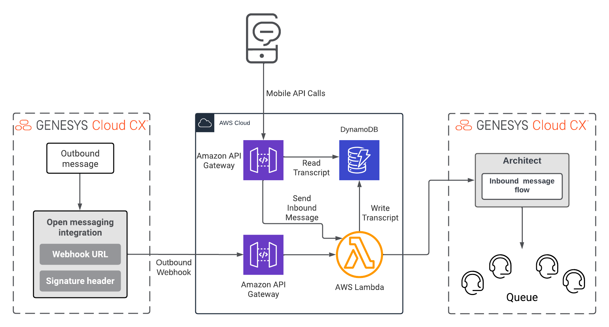

This Genesys Cloud Developer Blueprint explains how to develop a simple bidirectional chat functionality within a mobile app using Open messaging integration in Genesys Cloud and AWS services. 

## Scenario
Customer wants to add or extend the chat functionality of their existing mobile application. They require an in-app chat that allows their contact center agents to communicate directly with their customers.

## Solution
The chat functionality development includes the back-end and front-end interface development. For the front-end interface, the Ionic mobile app development platform integrated with Angular tool is used. For more information about the Ionic framework, see [https://ionicframework.com/](https://ionicframework.com/ "Opens the Ionic toolkit page").
Node.js is used for back-end development, executed within AWS Lambda and exposed via the Amazon API Gateway.

The blueprint showcases how to leverage the open messaging integration in Genesys Cloud and the AWS services to create a chat functionality.



## Contents
* [Solution components](#solution-components)
* [Prerequisites](#prerequisites)
* [Implementation steps](#implementation-steps)
* [Additional resources](#additional-resources)

## Solution components

* **Genesys Cloud** - A suite of Genesys Cloud services for enterprise-grade communications, collaboration, and contact center management. In this solution, you use an Architect inbound email flow, integration, data action, queues, and email configuration in Genesys Cloud.
* **Amazon API Gateway** - An AWS service for using APIs in a secure and scalable environment. In this solution, the API Gateway exposes a REST endpoint that is protected by an API key. Requests that come to the gateway are forwarded to an AWS Lambda.
* **AWS Lambda** - A serverless computing service for running code without creating or maintaining the underlying infrastructure. In this solution, AWS Lambda processes requests that come through the Amazon API Gateway and calls the Amazon Comprehend endpoint.
* **AWS DynamoDB** - A fully managed NoSQL database service offered by Amazon Web Services. The service supports key-valued cloud services and data structures designed to run high-performance applications at any scale.
  
## Prerequisites

### Specialized knowledge
* Administrator-level knowledge of Genesys Cloud.
* AWS Cloud Practitioner-level knowledge of AWS IAM, Amazon API Gateway, AWS Lambda, and Amazon DynamoDB.
  
### Genesys Cloud account

* A Genesys Cloud license. For more information, see [Genesys Cloud Pricing](https://www.genesys.com/pricing "Opens the Genesys Cloud pricing page") in the Genesys website.
* Master Admin role. For more information, see [Roles and permissions overview](https://help.mypurecloud.com/?p=24360 "Opens the Roles and permissions overview article") in the Genesys Cloud Resource Center.

### AWS account
* An administrator account with permissions to access the following services:
  * AWS Identity and Access Management (IAM)
  * Amazon API Gateway
  * Amazon DynamoDB
  * AWS Lambda
* AWS credentials. For more information about setting up your AWS credentials on your local machine, see [About credential providers](https://docs.aws.amazon.com/sdkref/latest/guide/creds-config-files.html "Opens the About credential providers page") in AWS documentation.
* AWS CLI. For more information about installing the AWS CLI on your local machine, see [About credential providers](https://aws.amazon.com/cli/ "Opens the About credential providers page") in the AWS documentation.

## Implementation steps

1. Clone the GitHub repository

### Clone the GitHub repository
Clone the GitHub repository [ionic-mobile-open-messaging-blueprint](https://github.com/GenesysCloudBlueprints/ionic-mobile-open-messaging-blueprint "Opens the ionic-mobile-open-messaging-blueprint repository). The repository folder includes the sample configuration settings and folder structure for the front-end and back-end of the application. 

### Create an OAuth client in Genesys Cloud

1. In Genesys Cloud, navigate to **Admin** > **OAuth** and click **Add Client**.
2. Create an OAuth client with the following options:
   1. Enter a name for the client and select **Client Credentials** as the Grant Type.
   2. Click the **Roles** tab and select the role that has the following permissions:
      1. Analytics > conversationDetail > View
      2. Conversation > message > All Permissions
3. Click **Save** and note the **Client ID** and **Client Secret** fields to use in the AWS Lambda setup.

### Create the Amazon DynamoDB tables

1. Create a table for Open messaging transcript. 
   This is a persistent storage for the chat transcript that the Genesys Cloud writes to when an agent replies to a customer. Add the following columns to the table:
   1. id
      * type - String
      * Partition Key
   2. channelTime
      * type - String
      * Sort Key
2. Create a table for the Notifications. This table is for pushing notifications to the app. The table is used only with the API. If you want Genesys Cloud to write to this table, then you must incorporate a data action to call the API. This table is optional only if you have the Notifications tab in the app. Add the following columns to the table:
   1. id
      * type - String
      * Partition Key
   2. channelTime
      * type - String
      * Sort Key

### Create an AWS S3 bucket
To store any media sent from the Ionic front-end app, create an Amazon S3 bucket storage. The S3 bucket must have public read access for the objects. Ensure that you implement the security measures that are in line with your company.

### Create a function using AWS Lambda

1. Create a function using AWS Lambda in your AWS account.
2. Configure the Environment variables of the function using the following keys:
   * GC_CLIENT_ID and GC_CLIENT_SECRET - Genesys Cloud OAuth client.
   * TRANSCRIPT_TABLE_NAME - The name of the table created in DynamoDB.
   * NOTIFICATION_TABLE_NAME - The name of the table created for notifications in DynamoDB.
   * S3_URL_BUCKET - URL of the S3 bucket that stores the media files.
3. Grant access to the Lambda function to allow the following services via IAM:
   * PutObject - Adds an object to the S3 bucket.
   * Scan, Query, GetItem, and PutItem - For the Amazon DynamoDB tables that you have created in the previous step.
4.  Package and deploy the Lambda function:
    1.  To install the function, run `npm install` in the ./lambda-backend folder.
    2.  To package the function, create a zip of the node_module folder and the index.js file.
    3.  To deploy the function, upload the zip to Lambda using the AWS console.
5. Deploy the Lambda function.


### Add an Amazon API Gateway to the Lambda function
Add an Amazon API gateway to your Lambda function. 
1. Create a REST API.
2. You can use the Open API Definition to import the API resources and methods.
3. Associate each method with the Lambda function.
4. Set up a mock Lambda integration.
5. For a mock integration, enable CORS by creating an OPTIONS method to return the required Method Response headers
   * `Access-Control-Allow-Headers`
   * `Access-Control-Allow-Methods`
   * `Access-Control-Allow-Origin`
:::primary
**Note**: The responses can contain wild cards that allow you to bypass the CORS issues on browser-based applications.
::: 
1. Deploy the API and make a note of the API endpoint URL for later use.

### Create the Open messaging integration in Genesys Cloud
For more information about setting up an open messaging integration, see [Configuring an open messaging integration](https://help.mypurecloud.com/articles/configure-an-open-messaging-integration/ "Opens the Configuring an open messaging integration article") in the Genesys Cloud Resource Center. Use the following information to configure the integration:
* Provide the Amazon API Gateway URL for Outbound Notification Webhook URL followed by `/demoopenmessagewebhook`.
* We recommend using the secret token to validate the message.

When you set up the integration, you must get the GUID of the integration. You can use the Genesys Cloud API explorer to get the GUID:
1. Open the [Genesys Cloud API Explorer](https://developer.genesys.cloud/developer-tools/#/api-explorer "Opens the Genesys Cloud Developer API Explorer page").
2. Navigate to **Conversations** > **Messaging**.
3. Select **GET Get a list of Open messaging integrations**.
4. Click **Send Request**.
5. Search for your integration using the `name` field in the Response.
6. Note the GUID of the integration, which is in the `id` field of your integration. 
:::primary
**Note**: You require the GUID of the integration to configure the Ionic front-end framework.
:::

### Set up Genesys Cloud routing
Set up routing for the integration to route the messages to your agents or bot.

1. In Genesys Cloud, navigate to **Admin** > **Architect**.
2. In Architect, create an Inbound Message flow. For more information, see [Add an inbound message flow](https://help.mypurecloud.com/articles/inbound-message-flows/ "Opens the Inbound message flows overview") in the Genesys Cloud Resource Center.
3. Navigate to **Admin** > **Routing** > **Message Routing**.
4. Associate the inbound message flow with a message route. Select the open messaging integration as the inbound address to enter the inbound message flow. For more information, see [Message routing](https://help.mypurecloud.com/articles/about-message-routing/ "Opens the Message routing overview article.")

### Configure and run Ionic framework
Install the Ionic toolkit from the instructions [here](https://ionicframework.com/ "Opens the Ionic framework website").
1. After installation, populate the environment file ` ./ionic-frontend/src/environments/environment.ts` with the following information:
   1. Enter the Amazon API Gateway URL for trancriptAPIBaseURL followed by `/transcript/integration/`.
   2. Enter the Amazon API Gateway URL for notificationAPIBaseURL followed by `/notification/integration/`.
   3. Specify the GUID of the Genesys Cloud open messaging integration in the `integrations` array. Replace the existing value with the GUID that is already present for `chat` and `offers` objects.
   4. Provide the `userId` in the format of the email address of the user. 
For more information about installing and running the project using the Ionic toolkit, see [here](https://github.com/shansrini/ionic-mobile-open-messaging-blueprint/blob/main/ionic-frontend/README.md).

If you have set with Ionic and `npm`, you can navigate to the ionic-frontend folder and execute `ionic serve` in the command prompt.

### How it works?

Once you have set up everything, send a message from the chat widget of the Ionic front-end interface. The chat message is routed to Genesys Cloud Inbound Message flow. The agent responds from the Genesys Cloud agent desktop and Genesys Cloud sends the message to the webhook URL defined in the open messaging integration.

**Agentless setup**
If you want to send an agentless message, you must invoke the Genesys Cloud API. For more information, see [Conversations](https://developer.genesys.cloud/api/rest/v2/conversations/#post-api-v2-conversations-messages-agentless "Opens the Conversations page") in Genesys Cloud Developer Center.

**Offers**
You can use the **Offers** tab in the Ionic front-end interface to push any information or coupons to your customers. Replies are not allowed for such messages. To use the **Offers** option, post a message to your Amazon API Gateway using the Amazon API gateway endpoint that you have created.
```
POST <Amazon API Gateway URL>/notification/integration/{integrationId}/user/{userId}
```
From the Ionic configuration file, get the following details:
* `integrationId` - The ID from the integrations section for the `Offers` type.
* `userId` - The email address of the user.

Use the following format for the POST request body text:
```
{
    "type": "text",
    "content": "SuperCoupon",
    "fromId": "agentId"
}
```
**QR code support**
The application can render QR codes in both the **Connect** and the **Offers** tab of the Ionic front-end interface. Use the following format from the Genesys Cloud Agent desktop or the Agentless API in the body text:
```
    "gcDecoratedMessage": {
        "gcMessageType": "qrCode",
        "gcMessageText": "SuperSpecialCoupon!"
    }
}
```
In the **Offers** tab, you can POST this message body to the Amazon API Gateway URL `<Amazon API Gateway URL>/notification/integration/{integrationId}/user/{userId}`:
```
{
    "type": "qrcode",
    "content": "SuperCoupon",
    "fromId": "agentId"
}
```
## Additional resources
* [Amazon API Gateway](https://aws.amazon.com/api-gateway/ "Opens the Amazon API Gateway page") in the Amazon featured services
* [AWS Lambda](https://aws.amazon.com/translate/ "Opens the Amazon AWS Lambda page") in the Amazon featured services
* [Ionic Docs](https://ionicframework.com/docs/ "Opens the Ionic framework documentation") in the Ionic framework site
* [Open messaging integration](https://help.mypurecloud.com/articles/about-open-messaging/ "Opens the About open messaging page") in the Genesys Cloud Resource Center
